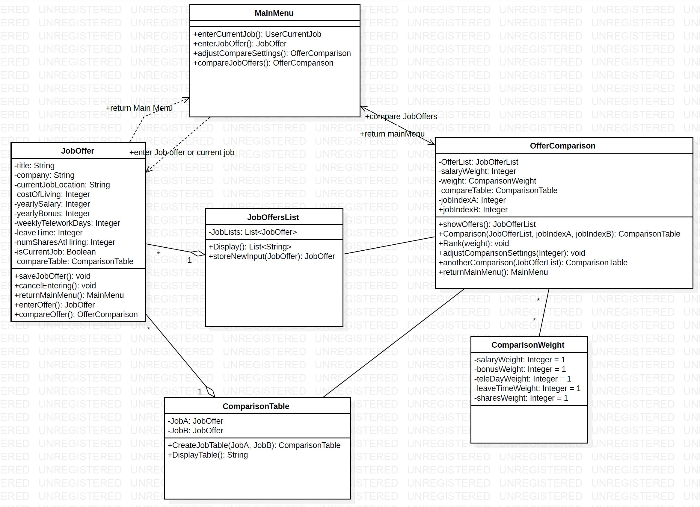

# Design 1

## pros:
- Inclusion of a class named "User" that ties to the other classes which maintains a coherent design.
- Differentiated two subcategories for the "Job" class which are "JobOffer" and "CurrentJob". This will simplify the code since "CurrentJob" and "JobOffer" have some differences in their requirements per the problem statement.
## cons:
- The use of many interactions/relationships makes it more difficult to follow and implement the design.
- Listing methods on the lines connecting the classes.
- Not declaring the type of data type for each attribute.

# Design 2

## pros:
- Simple clean design.
- Easy to understand.
## cons:
- Missing some attributes and shortened that list by including "..."
- While combining some classes simplified the UML, the code itself will be more complicated and harder to maintain and expand.
  -  Example of such combination: "comparisonWeights" were included as an attribute for the "System class"

# Design 3

## pros:
- Simple design.
- Differentiated two subcategories for the "Job" class which are "JobOffer" and "CurrentJob". This will simplify the code since "CurrentJob" and "JobOffer" have some differences in their requirements per the problem statement.
## cons:
- Used "verbs" to name the classes.
- Used "upper caps" to name the methods rather than "lower caps"
- Did not include a "User/System" class that ties and calls other classes in the system.

# Design 4

## pros:
- Inclusion of a class named "MainMenu" that ties to the other classes which maintains a coherent design.
- Included the default values for the "ComparisonWeight"
## cons:
- The class "JobOfferList" is only used to save the current offers, but it could have been merged to another class to simplify the design.
- Listing methods on the lines connecting the classes.
- Use class named as data types for some attributes for the class named "OfferComparison". For example:
  - Use "ComparisonWeight" as the data type for the "weight" attribute 

# Team Design

During our group meeting, each team member presented  his design then it was collectively discussed. Based on these 
discussions,
we 
  identified pros and cons of each design (see above sections). These were used to prepare a draft design for the 
  team that was subsequently discussed in another meeting again.

Main discussion points during our group meetings:
- How to name classes?
- Should we implement a separate class for each page?
- Should there be a separate class used to save the comparison weights?
- Should we have a single job class that can be used to enter the "current job" as well as the "job
  offers", or we need to add sub-classes too?
  - Maybe using a Boolean while entering job info is okay to identify whether the info is for a "current job" or
    an "offer".
- What should be the metric deciding a good class design?
- Discussed the relationship between classes.

In the team design we:
- Avoided the cons listed above that were identified in each of the individual designs.
- Used a simple design (as it was noted for Designs 2 and 3).
- We added a "User" class that communicates with the different classes to tie in the different components of the app 
  (Designs 1 and 4)
- Differentiated two subcategories for the "ItemInfo" class which are "JobOffer" and "CurrentJob" (Designs 1 and 3).
- Included the type of each attribute (Designs 2, 3, and 4) and the type of each method output (Design 4).
- Included the default values for the "ComparisonWeight" (Design 4)
- "ComparisonSettings" is a standalone class (Designs 1 and 3)
- Include a class to save/generate an SQL Database

# Summary
From our first meeting it was clear that each one of our group members approached Assignment 5 differently. 
Constructive discussions about the pros and cons of each design helped the team to agree on several key modifications that 
encompassed what we thought to be the strength points in each of the individual designs. As a result, we believe 
that the current team design is a significant improvement over the individual designs.

The main lesson learnt in this exercise is that software designs can vary significantly between developers. 
Therefore, regular meeting among the developing team seems to be a must to achieve a successful end product/software.
Even though our team design is an improvement over the different individual ones, there sure still is room for 
improvement.