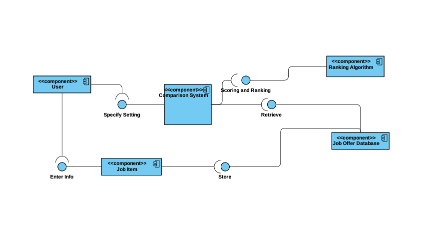
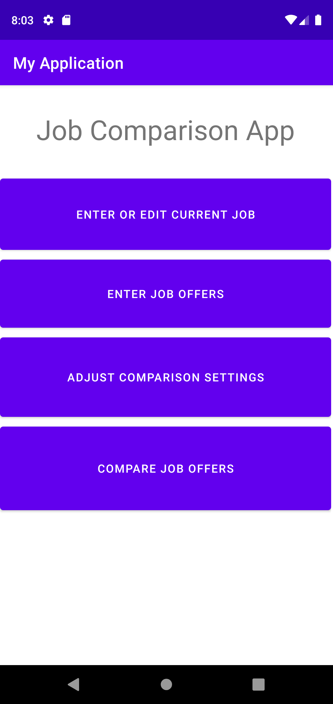
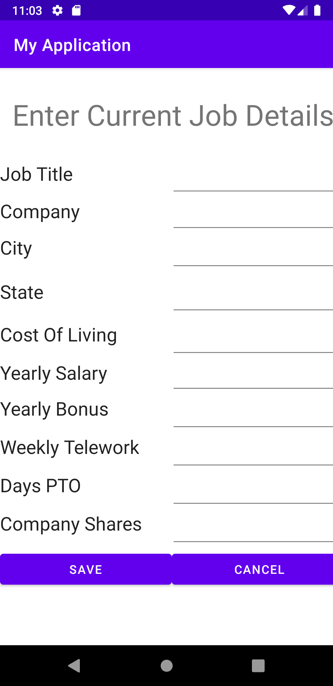
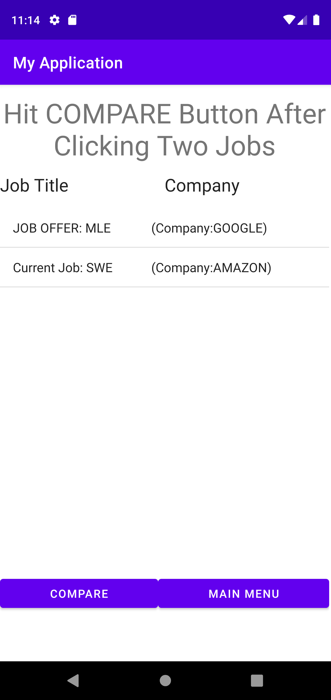
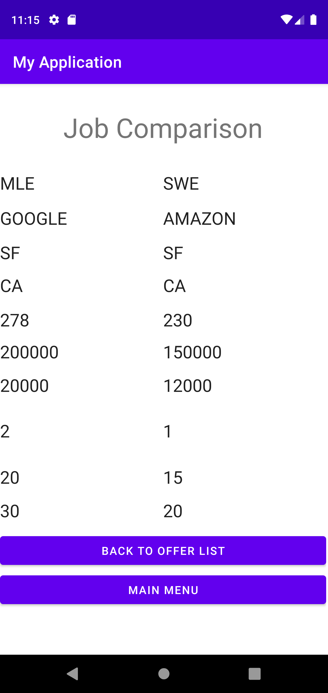
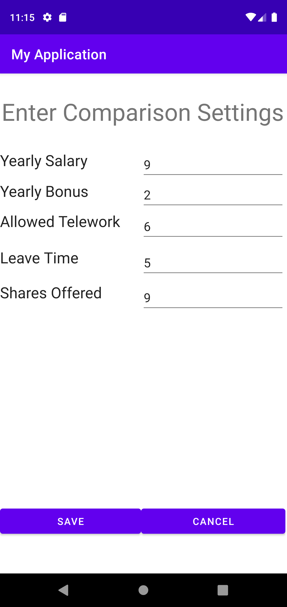

# Design Document - Team 044

## 1. Design Consideration

### 1.1 Assumptions

* I assmues the application is deployed on Android devices

* The app would implement and maintain its own database for all the job offers. the data would be stored locally

### 1.2 Constraints

* The app uses its own ranking algorithm. Thus, the app should use a persistence layer to maintain persistent layer. A SQLite database shall be used to store persistent information

### 1.3 System Environment

Hardware: Android mobile phone with screen size of at least 5''

Software: An Andoird App with minimum sdk version 28, Android 9.0.

## 2. Architectural Design

### 2.1 Component Diagram

* The User Component is how will the user interact with the comparison system and input job offer item info into the app.
* The Comparison System is where comparisons occurs. Two offers will compare in a table view. 
* The Job Item component is a single Job Offer Item. It is the building block of the Comparison System
* The Database is where all the job offers are stored
* The Ranking Algorithm is a componnet which fulfills the ranking algorithm of the Job Offer List.

### 2.2 Deployment Diagram

The app would be deployed locally, on a single android device. Thus a deployment diagram would not be necessary.

## 3.  Low-Level Diagram:

### 3.1 Class Diagram (UML)

### 3.2 Other Diagrams

## 4 User Interface Design

| Main menu                                                    | Enter Job Details                                            | Current Job                                                  |
| ------------------------------------------------------------ | ------------------------------------------------------------ | ------------------------------------------------------------ |
|  |  |  |

| Offer List                                                   | Comparison Table                                             | Configure Settings                                           |
| ------------------------------------------------------------ | ------------------------------------------------------------ | ------------------------------------------------------------ |
|  |  |  |

 

