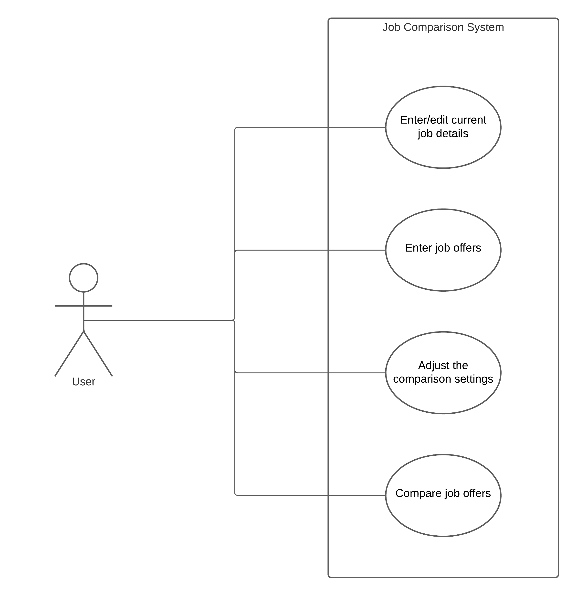

# Use Case Model

**Author**: Team 044

## 1 Use Case Diagram

## 2 Use Case Descriptions

According to George P. Burdell's requirements, our team has identified four use cases:

1. Enter or edit current job details
2. Enter job offers
3. Adjust the comparison settings
4. Compare job offers

We would like to elaborate our use case descriptions from four aspects: 1) requirements, 2) pre-conditions, 3) post-conditions Conditions, and 4) scenarios.

### Use  Case 1: Enter or Edit Current Job Details

- **Requirements**: 1) a user interface is shown to enter (if it is the first time) or edit all of the details of their current job, and 2) user is able to either save the job details or cancel and exit without saving, returning in both cases to the main menu.
- **Pre-conditions**: the system has no job information (user uses the app for the first time), or the system has the current job information (user has entered the job information before).
- **Post-conditions**: user will be asked to either save the job details or cancel and exit without saving, returning in both cases to the main menu.
- **Scenarios**: 1) user starts the app, 2) user is asked to enter current job information (if it is the first time), 3) user is asked to edit job information, 4) user is asked to either save the job details or cancel and exit without saving, returning in both cases to the main menu.

### Use  Case 2: Enter Job Offers

- **Requirements**: 1) a user interface is shown to enter all of the details of the offer, 2) user is able to either save the job offer details or cancel, and 3) user is  able to (a) enter another offer, (b) return to the main menu, or (c) compare the offer (if they saved it) with the current job details (if present).
- **Pre-conditions**: no pre conditions
- **Post-conditions**: 1) user is able to either save the job offer details or cancel, and 2) user is  able to (a) enter another offer, (b) return to the main menu, or (c) compare the offer (if they saved it and the system has at least two job records) with the current job details (if present).
- **Scenarios**: 1) user starts the app, 2) user enters current job information 3) user is provided three options: (a) enter another offer, (b) return to the main menu, or (c) compare the offer

### Use  Case 3: Adjust the Comparison Settings

- **Requirements**: 1) the user can assign integer weights to 5 factors if he wants to, and 2) if no weights are assigned, all factors are considered equal.
- **Pre-conditions**: the user chooses to adjust the comparison settings.
- **Post-conditions**: the comparison settings are adjusted
- **Scenarios**: 1) the user choose to adjust comparison settings, 2) the user enters enters weight for five factors (optional), 3) the comparison settings are adjusted or remain unchanged (if user only check the settings without changing them).

### Use  Case 4: Compare Job Offers

- **Requirements**: 1) the user is shown a list of job offers, displayed as Title and Company, ranked from best to worst (see below for details), and including the current job (if present), clearly indicated, 2) the user selects two jobs to compare and trigger the comparison, 3) if the user chooses to make the comparison, he will be shown a table comparing the two jobs, 4) the user will offered to perform another comparison or go back to the main menu.
- **Pre-conditions**: 1) the system has at least two job records (either one current job and one job offer or two job offers in the system), 2) the user is shown a list of job offers, displayed as Title and Company, ranked from best to worst (see below for details), and including the current job (if present), clearly indicated, 
- **Post-conditions**: 1) the user will be shown a table comparing the two jobs, displaying, for each job, and 2) the user will offered to perform another comparison or go back to the main menu.
- **Scenarios**: 1) the user chooses to compare job offers, 2) the user is shown a list of job offers to be selected from, 3) user selects two jobs to compare and trigger the comparison, 4) the user is shown a table comparing the two jobs, 5) the user will offered to perform another comparison or go back to the main menu.
